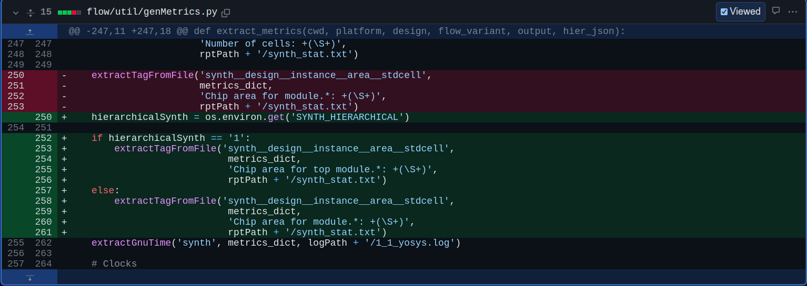

# OpenROAD & VSD - 7nm PD Contest

## Presented By

Yatharth Agarwal 


##  Introduction to OpenROAD & Flow controllers

**OpenROAD** is an integrated chip physical design tool that takes a design from from RTL to GDSII, including synthesis, floorplanning, placement, routing, signoff parasitic extraction and timing analysis. 

It uses a hierarchical placement algorithm that aims to minimize wire length, and it provides several features to optimize timing and power consumption. OpenROAD is designed to be extensible and customizable, with a flexible architecture that allows users to add their own algorithms and features.


The OpenROAD project supports a flow controllers namely

**OpenROAD-flow-scripts(ORFS)** is a flow controller that provides a collection of open-source tools for automated digital ASIC design from synthesis to layout. It provides a fully automated RTL-to-GDSII design flow, which includes Synthesis, Placement and Routing (PnR), STA (Static Timing Analysis), DRC (Design Rule Check) and LVS (Layout Versus Schematic) checks. ORFS aims to provide a flexible and customizable environment for digital ASIC design, allowing users to choose and combine different tools as needed. 

   - In ORFS, OpenROAD is used as a plugin for the physical design stage, and it can be configured and customized to meet the specific needs of the design project. The OpenROAD plugin in ORFS provides access to several advanced features, such as hierarchical placement, global routing, and detailed routing optimization.

   - ORFS  supports several public and private PDKs (under NDA). Available public PDK's are GF180, Skywater130, ASAP7 etc.


> More about the OpenROAD Project can be found [here](https://openroad.readthedocs.io/en/latest/main/README.html)

## Tool Improvements (1) - Updated util/genMetrics.py (Merged #900)

Link to pull request [900](https://github.com/The-OpenROAD-Project/OpenROAD-flow-scripts/pull/900)

### Problem
When export `SYNTH_HIERARCHICAL = `1 is defined in the `config.mk` for the hierarchical synthesis, the format of the generated synth_stat is different.

[synth_stat_flat.txt](https://github.com/The-OpenROAD-Project/OpenROAD-flow-scripts/files/11017803/synth_stat_flat.txt)
[synth_stat_hier.txt](https://github.com/The-OpenROAD-Project/OpenROAD-flow-scripts/files/11017804/synth_stat_hier.txt)

This leads to the `genMetrics.py` copying the wrong core area, which is arbitrarily small.

Further, when `genRuleFile.py` is executed using `make update_ok`, the `synth__design__instance__area__stdcell` variable is rounded to zero resulting in an incorrect metadata file.


### Changes 
The updated `genMetrics.py` file accounts for flat synthesis and hierarchical synthesis, reporting the correct area data.



The metadata and rule files for `asap7/riscv32i` are also updated with drc clean and 0wns design metrics to account for the wrong values of `synth__design__instance__area__stdcell`

Further for other design having the same issue, the metadata files were also updated in the tool. These include the following designs

```
asap7/swerv_wrapper
nangate45/ariane136
nangate45/black_parrot
nangate45/bp_be_top
nangate45/bp_fe_top
nangate45/bp_multi_top
nangate45/swerv_wrapper
```

## Tool Improvements (2) - Asap7 drc lvs (Open #883)

Link to pull request [883](https://github.com/The-OpenROAD-Project/OpenROAD-flow-scripts/pull/883)

Implements DRC check for final GDSII in ASAP7. The check accurately compares the rules defined in the ASAP7 pdk design reference manual with the final GDSII using KLayout and stores the result in `6_drc_count.rpt`

This is based available at [https://github.com/laurentc2/ASAP7_for_KLayout](https://github.com/laurentc2/ASAP7_for_KLayout). I modified it to work with ORFS makefile and tested it on the UART and gcd designs. 


## Conclusion

This hackathon was a great exposure to ORFS and understanding the flow along with the file directories. I definitely look forward to using this tool more and also contributing to the project to make Chip design more accessible and availible for all. 

I would like to thank  Vijayan Krishnan, Matt Liberty and the teams from VSD and OpenRoad to provide this amazing opportunity and being patient with my countless doubts. 

